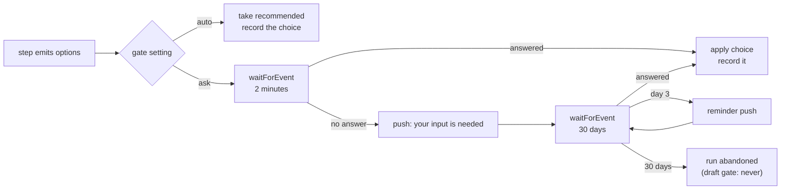
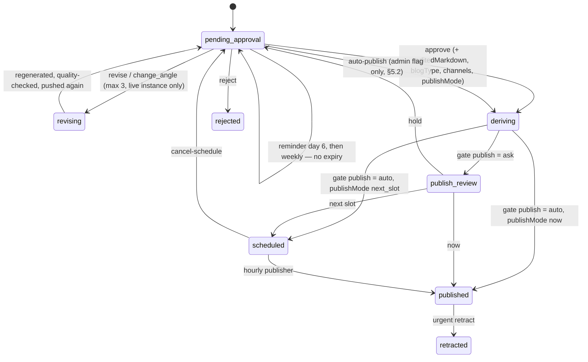

# Article Workflow — trigger to published (v2, target state)

How one article is made under the revised pipeline: who starts a run, where the human
decides, what each step spends, and what reaches Sanity. The state machine of record is
[design.md §5](design.md); this is the operator's and newcomer's view of it.

Steps marked **new** or **changed** do not exist in the code yet. Everything else links to the
current implementation.

Everything below happens inside **one durable Workflow instance per run**
([`PipelineWorkflow`](../codebase/apps/backend/src/workflows/pipeline.ts)). The instance stays
alive across every gate; if it times out at the draft gate, the draft survives it (see §5).

---

## 0. What changed from v1

| Area | v1 | v2 |
|---|---|---|
| Who starts a run | daily cron for every user | the **Generate** button; cron only for users with `autoRun` on (default off) and active in the last 7 days |
| Search | one search, 10 results, feeds the draft | snippet-only `search` to choose, full-content `fetch-sources` for the chosen topic only |
| Pre-draft control | angle choice on user-topic runs only | optional gates at **topic, angle, outline, image, derivatives, publish** — `ask` or `auto` per gate, per user |
| New steps | — | `synthesize-candidates`, `fetch-sources`, `outline`, `quality-check`, `image-concepts`, `hero-image`, one step per derivative |
| Derivatives | before review (X, LinkedIn, translation), always | **after approval**, from the final approved markdown, and **only the channels the user ticks** at the derivatives gate |
| Draft gate | expires after 7 days, markdown purged | **never expires** — reminders on day 6, then weekly |
| Pending-drafts rule | skip when 2 pending | skip when **1** pending; a tap opens the pending draft |
| Auto-publish | — | admin-only flag, default off, blocked for medical profiles |
| Step granularity | some steps bundle 2–3 billable calls | **one billable call per step** — a failed call never re-bills a successful one |

---

## 1. At a glance

```mermaid
flowchart TD
    A1["Generate button<br/>POST /runs/trigger"] --> R
    A2["POST /runs/request<br/>(user topic)"] --> R
    A3["daily cron 06:00 UTC<br/>only users with autoRun on"] --> R
    R["pipeline_runs row<br/>+ Workflow instance"] --> G{"gates"}

    G -->|"cap · pause · suspended<br/>undecided draft exists<br/>autoRun user inactive over 7 d"| SK["skipped / failed<br/>(reason recorded)"]
    G -->|ok| P["load-profile<br/>pins profile version"]
    P --> T{"trigger"}

    T -->|"generate / auto"| SE["search<br/>snippets only"]
    SE --> SY["synthesize-candidates"]
    SY --> SC["score — best candidate"]
    SC -->|"nothing scored 6+"| SK2["skipped"]
    SC --> GT
    T -->|"user topic"| RS["research<br/>targeted search + links"]
    RS --> FS

    GT{{"gate: topic<br/>ask | auto"}} -->|"pick · free text · auto"| FS["fetch-sources<br/>full content, chosen topic only"]
    FS --> AN["angles — 3 + recommended"]
    AN --> GA{{"gate: angle<br/>ask | auto"}}
    GA --> OL["outline<br/>headings + key points"]
    OL --> GO{{"gate: outline<br/>ask | auto"}}
    GO --> AR["draft — the article"]
    AR --> QC["quality-check"]
    QC -->|"fail → one auto-revise"| AR
    QC -->|pass or already revised| SD["save-draft"]
    SD --> IC["image-concepts<br/>2–3 as text"]
    IC --> GI{{"gate: image<br/>ask | auto"}}
    GI --> HI["hero-image<br/>generate + upload"]
    HI --> WS["write-sanity-draft<br/>drafts.draft-runId"]
    WS --> N["push: draft ready"]
    N --> W{{"gate: draft<br/>no expiry — reminders"}}

    W -->|"revise (max 3)"| AR
    W -->|"change_angle (max 3)"| OL
    W -->|reject| RJ["rejected<br/>Sanity draft deleted"]
    W -->|"approve<br/>(+ edits · blogType · publishMode)"| GD{{"gate: derivatives<br/>X? LinkedIn? Arabic?"}}
    GD -->|"any subset ticked"| DX["derive-x"]
    DX --> DL["derive-linkedin"]
    DL --> TR["translate<br/>from final markdown"]
    TR --> GP{{"gate: publish<br/>ask | auto"}}
    GD -->|"none — article only"| GP
    GP -->|now| PUB["publishApprovedDraft"]
    GP -->|next_slot| SCH["scheduled<br/>hourly publisher"]
    GP -->|hold| W
    SCH --> PUB
    PUB --> LIVE["published<br/>+ translated edition"]
    LIVE --> REC["record<br/>run closed · choices stored"]
```



Any pre-draft gate (`topic`, `angle`, `outline`, `image`) left unanswered for 30 days ends the
run as `abandoned` — never auto-proceed, because that would spend on someone who has gone
quiet. The draft gate is the one gate that never times the *draft* out.

---

## 2. Entry points

All three create one `pipeline_runs` row and one Workflow instance keyed to it.

| Trigger | Entry point | Notes |
|---|---|---|
| **Generate** (primary) | [`POST /runs/trigger`](../codebase/apps/backend/src/api/runs.ts#L79) | the home-screen button. Refused while `runs.paused` (FR-15.12c). If the user already has an undecided draft, the app opens that draft instead of starting a run |
| User topic | [`POST /runs/request`](../codebase/apps/backend/src/api/runs.ts#L101) | banned-topic collision → 409 until resubmitted with `overrideBannedTopics: true`; 30-day dedup similarity warns but never blocks (FR-7.7) |
| Scheduled (opt-in) | cron `0 6 * * *` → [`dailyDispatch`](../codebase/apps/backend/src/index.ts#L41) **changed** | launches only for users with `profile.autoRun = true` *and* `last_active_at` within 7 days *and* today in `cadence.preferredDays`. Everyone else gets nothing — no run, no spend |

The principle: **the only money spent is money a user asked to spend.** Cron keeps running
only free jobs — the hourly publisher, route health, gate and draft reminders, a nudge push
after 7 days of silence ("tap to get a draft on what's trending"), and the weekly Sanity export.

Only the **production** Worker owns cron schedules (FR-8.5). Staging must move to its own Neon
branch so staging runs stop consuming production caps and polluting `spend_ledger`.

---

## 3. Inside the run, step by step

Every row is a `step.do` — durable, idempotent, `runId`-scoped, and holding **at most one
billable call**, so a retry never re-bills a call that already succeeded. The **AI** column marks
the provider each step bills; the **Gate** column marks where the run may pause for the user.

| # | Step | What it does | AI | Gate after |
|---|---|---|---|---|
| 1 | [`gates`](../codebase/apps/backend/src/workflows/pipeline.ts#L87) **changed** | budget caps (global + per-user), rate limit, `ai.paused`, suspension, **no undecided draft** (was: fewer than 2), and for scheduled runs the activity check | — | — |
| 2 | [`load-profile`](../codebase/apps/backend/src/workflows/pipeline.ts#L113) | pins the **active profile version** for the whole run, including its `gates` settings | — | — |
| 3a | `search` **new** (split from `discover`) | snippet-only search on the profile's interests — titles and summaries, never full pages. Cheapest call in the run | search | — |
| 3b | `synthesize-candidates` **new** (split from `discover`) | turns the snippets into 8–10 candidate topics: title, why it's trending, source links. All persist to `topic_candidates` (DR-9.3) | Haiku | — |
| 3c | [`score`](../codebase/apps/backend/src/workflows/pipeline.ts#L132) | scores every candidate against the profile with rejection reasons; keeps those ≥ 6. Nothing qualifies → run ends `skipped` | Haiku | **topic** |
| 3d | [`research`](../codebase/apps/backend/src/workflows/pipeline.ts#L124) | *user-topic runs only* — replaces 3a–3c and the topic gate: targeted search plus the user's links → a brief with cited sources | search + Haiku | — |
| 4 | `fetch-sources` **new** | full-content fetch for the **chosen topic only** — the article's grounding. One deep fetch instead of ten shallow ones | search | — |
| 5 | [`angles`](../codebase/apps/backend/src/workflows/pipeline.ts#L147) **changed** | proposes 3 angles and a recommendation, stored on the run | Sonnet (A/B Haiku) | **angle** |
| 6 | `outline` **new** | section headings with 1–2 key points each for the chosen angle. Ten seconds to review, prevents most whole-article revisions | Haiku | **outline** |
| 7 | [`draft`](../codebase/apps/backend/src/workflows/pipeline.ts#L168) **changed** | writes the article from the composed prompt (editorial rules + voice + audience + guardrails + few-shot approved posts + the approved outline). `CANNOT_COMPLY` is non-retryable — a decision, not a failure. Prompt uses a `cache_control` breakpoint after the stable prefix | Sonnet | — |
| 8 | `quality-check` **new** | checks the finished article: disclaimer present (medical profiles), no diagnosis/dosage language, correct language, within length, banned topics absent, not similar to the last 30 days, outline honoured. **Fail → one automatic revise** with the findings, then proceed regardless; findings are shown on the review screen | Haiku | — |
| 9 | [`save-draft`](../codebase/apps/backend/src/workflows/pipeline.ts#L182) | the `drafts` row — markdown lives here, the app's editing source of truth until publish (DR-9.11) | — | — |
| 10 | `image-concepts` **new** | 2–3 hero-image concepts as short text descriptions. The image is *not* generated yet | Haiku | **image** |
| 11 | `hero-image` **new** (split from `create-sanity-draft`) | generates the chosen concept at the route's pinned `quality`, uploads to Sanity assets, returns **only the asset reference**. Image bytes never leave this step | image | — |
| 12 | `write-sanity-draft` **changed** (rest of `create-sanity-draft`) | markdown → Portable Text, per-site mapper, writes `drafts.draft-{runId}` with the asset reference — deterministic id, so a retry cannot duplicate | — | — |
| 13 | [`notify`](../codebase/apps/backend/src/workflows/pipeline.ts#L218) | FCM "draft ready". Best-effort: a failed push never fails the run | — | **draft**, then **derivatives** |
| 14 | `derive-x` **new** (split from `derivatives`, moved after approval) | X version ≤ 280 chars, from the **final approved markdown**. Runs only if the user ticked X at the derivatives gate | Haiku | — |
| 15 | `derive-linkedin` **new** (same) | LinkedIn version, same rule | Haiku | — |
| 16 | `translate` **new** (same) | Arabic (or the profile's target language) edition, from the final approved markdown, only if ticked. Generated once — it can no longer drift from an edited article | Sonnet | **publish** |
| 17 | [`publish`](../codebase/apps/backend/src/modules/publishing/index.ts#L131) | `publishApprovedDraft` — see §6 | — | — |
| 18 | `record` | closes the run; the approved post becomes a few-shot candidate; every gate choice is stored as a preference signal for profile refinement | — | — |

Per-site mapping matters at steps 12 and 17: field names differ by project
(`body`/`publishDate` for `5gz3ngjs`, `content`/`datePublished` elsewhere), and Afnan's site
carries a per-draft `public`/`em` `blogType` chosen at approval.

**Spend before the draft gate** is now search ×2, Haiku ×5, Sonnet ×2 and one image. A run
abandoned at the topic gate has cost one snippet search and two Haiku calls. Derivatives and
translation are only ever produced for an article someone approved, and only the ones they
asked for.

---

## 4. Gates — choose and accept

A gate is a point where the run pauses and offers the user a choice. Every option-producing
step returns the same shape, so there is one review screen in Flutter and one handler in the
workflow:

```json
{
  "options": [
    { "id": "a", "title": "…", "summary": "…", "why": "…" },
    { "id": "b", "title": "…", "summary": "…", "why": "…" }
  ],
  "recommended": "a"
}
```

The user answers with an option `id`, or **free text** ("something about X instead"), which the
next step receives as an override. The AI that produces the options and the AI that recommends
one are the same call — the setting only decides whether the user sees it.

### 4.1 Settings

Per user, on the profile version, one setting per gate:

```
profile.gates = {
  topic:   "ask" | "auto",   // default auto  (recommended: ask — resolves in-session)
  angle:   "ask" | "auto",   // default auto  (recommended: ask — resolves in-session)
  outline: "ask" | "auto",   // default auto
  image:   "ask" | "auto",   // default auto
  derivatives: "ask" | "auto", // default ask — auto = profile.channels + translation.enabled
  publish: "ask" | "auto"    // default auto — auto = the publishMode given at approval
}
```

`auto` takes `recommended`. The **draft** gate has no setting — it is always `ask`, for every
user, and cannot be switched off (see auto-publish in §5.2 for the one admin-controlled
exception).

The **derivatives** gate is the one multi-select gate: the user ticks any subset of
X · LinkedIn · Arabic edition, or none for an article-only publish. It costs no extra pause —
the checkboxes sit on the approve screen, pre-ticked from the profile, and the selection
travels in the approve payload (`channels: ["x", "linkedin", "translation"]`). With `auto` the
checkboxes are hidden and the profile decides. Under auto-publish (§5.2) the profile decides
too.

### 4.2 How a gate resolves



The two-minute silent wait matters for fatigue: a user who just tapped **Generate** is standing
in the app, so topic → angle → outline resolve in one sitting with no push. A typical guided run
is two app sessions and one notification: tap, choose, choose, accept the outline; later, a
"draft ready" push; approve.

### 4.3 The gates

| Gate | After step | Options | Free text becomes |
|---|---|---|---|
| **topic** | `score` | the scored candidates, best first, with score and reason | a user-topic `research` step |
| **angle** | `angles` | the 3 proposals + recommendation | a fourth angle |
| **outline** | `outline` | one outline — approve, edit sections, or request another | instructions for a regenerated outline |
| **image** | `image-concepts` | 2–3 concepts, or "no hero image" | a custom concept |
| **draft** | `notify` | approve / revise / change_angle / reject (§5) | — |
| **derivatives** | approve | tick X · LinkedIn · Arabic edition, any subset or none (multi-select, on the approve screen) | — |
| **publish** | `translate` | now / next slot / hold, with the produced derivative texts shown | edits to a derivative text |

Every choice is written to the run row (it must be, to resume the workflow) and copied to the
preference log — which topics this creator picks, which angles, what they edit in outlines.
That is a better signal for profile refinement than edit diffs, and it is free.

---

## 5. The draft gate

State → `pending_approval`, and the workflow parks on `waitForEvent`.
[`POST /drafts/:id/decision`](../codebase/apps/backend/src/api/drafts.ts#L39) delivers the
verdict to the live instance, with a direct-handling fallback if the instance is gone.



| Decision | What happens |
|---|---|
| **approve** | optional `editedMarkdown` → diff stored (FR-6.9), Sanity draft patched; optional `blogType`; `channels` — the derivatives gate — says which of steps 14–16 run, from the final markdown; then the publish gate decides now / next slot / hold |
| **revise** | regenerates the article with the instructions, re-runs `quality-check`, patches the Sanity draft (hero image kept), pushes again. Capped at 3, enforced in the API *and* the loop |
| **change_angle** | re-enters at `outline` from one of the run's other stored angles (outline gate applies if `ask`), then the same loop as revise. Shares the cap of 3 |
| **reject** | deletes the Sanity draft, stores the category (quality / changed-mind / other), purges the markdown. The topic still counts toward the 30-day dedup window |
| **nothing** | **nothing is lost.** Reminder on day 6, then weekly. The draft stays at the top of the queue |

### 5.1 When the instance times out

The Workflow instance cannot wait forever. When its wait at the draft gate ends, the run is
marked `stale` — a flag, not a new state: the draft stays `pending_approval`, markdown kept,
Sanity draft kept, still first in the drafts queue. **approve, edit and reject** keep working
through the decision endpoint's direct-handling path (it runs steps 14–17 itself). Only
**revise** and **change_angle** need the live instance and are greyed out on a stale draft.
Reminders continue weekly.

### 5.2 Auto-publish

An admin-only flag on `user_limits.autoPublish`, **default off**, visible in the user's
settings as read-only. Enabling it is logged to `app_config_audit` with who and when.

When on, a draft left `pending_approval` for 7 days is auto-approved and published at the
next slot — only if **all** of the following hold, enforced in the API regardless of the flag:

- the profile has **no medical guardrails** — this cannot be enabled for Afnan's profile
- `quality-check` passed without a revise
- the user opened the draft at least once (`seen_at` is set)
- a warning push went out 24 hours earlier with a one-tap **Hold**, and was not acted on

---

## 6. Publish

Three paths, one function. `publishApprovedDraft` is the single choke point shared by the
publish gate (now), the hourly cron [`hourlyPublish`](../codebase/apps/backend/src/index.ts#L92)
(next slot) and the direct-handling path (stale drafts). In order it: refuses if
`publishing.paused` (scheduling is still allowed — the publisher simply holds), stamps the date
field and `blogType`, publishes the draft document, sets the row to `published` and **purges the
markdown** (DR-9.11), then — best effort, after the primary is already live — publishes the
translated edition as a second document. A failed translated edition never rolls back the
primary.

Publishing only ever happens in the production Worker (FR-8.5).

Afterwards: the run closes as `published`, the approved post becomes a few-shot candidate for
future generations, and [`POST /drafts/:id/retract`](../codebase/apps/backend/src/api/drafts.ts#L175)
can unpublish both the post and its translated edition.

---

## 7. When something goes wrong

**Derivatives degrade, they do not fail the run**, and now each is its own step:

| Case | Behaviour |
|---|---|
| Channel not ticked at the derivatives gate | `declined` — no call made, row recorded so the publish screen shows it was the user's choice, not a failure |
| Optional derivative has no enabled route | `skipped`, with the reason shown on the publish gate / review screen |
| Translation not requested by the profile | absent — no row at all, which is different from skipped |
| Translation requested but unroutable or failing | article publishes alone, translation marked `failed` with the reason |
| One derivative fails | only that step retries — X and LinkedIn are never re-billed for a failed translation |
| `quality-check` fails twice | the draft still goes to review, with the findings attached — the human is the final check |
| Article generation has no enabled route | the run fails, naming the task type — there is no draft without it |
| A gate refuses mid-run (`ai.paused`, a cap, suspension) | propagates and halts the step; a deliberate stop outranks degrading |
| A pre-draft gate is unanswered for 30 days | `abandoned`, with the small spend so far recorded against it |

**Everything else:** a step whose retries are exhausted sets the run to `failed`, records the
message, and pushes "Pipeline run failed". Budget caps deliberately report as `failed` rather
than `skipped`, so exhaustion shows up in failure rates.

Emergency switches (`ai.paused`, `publishing.paused`, `runs.paused`, per-user suspend, urgent
retract) are in the [runbook](runbook.md#1-emergency-controls-design-101).

---

## 8. What a run costs

| Point in the run | Billed so far |
|---|---|
| abandoned at the topic gate | 1 snippet search, 2 Haiku |
| abandoned at the angle gate | + 1 full-content fetch, 1 Sonnet |
| abandoned at the outline gate | + 1 Haiku |
| draft ready for review | + 1 Sonnet (article), 1–2 Haiku (quality check, concepts), 1 image |
| each revision | + 1 Sonnet, 1 Haiku — no derivatives, no image |
| approved and published | + only what was ticked: up to 2 Haiku (X, LinkedIn) and 1 Sonnet (Arabic edition); article-only adds nothing |

Compared with v1: a rejected draft no longer carries three derivatives and a translation; a
revision costs one article instead of an article plus three derivatives; a translation is billed
once, from the text that actually ships. `spend_ledger` records `task_type`, `provider`, `model`
and `run_id` per call — `GET /admin/budget` should grow a breakdown by task, by model and by run
outcome so that **cost per published article** is one query.

---

## 9. Known gaps

- **Publish confirmation.** The Sanity webhook (FR-8.6) is still `notImplemented` in
  [`webhooks.ts`](../codebase/apps/backend/src/api/webhooks.ts#L7); `published` is asserted
  from the mutation response.
- **Feedback loop not closed.** Edit diffs and gate choices are stored, but `writeArticle` still
  passes `approvedExamples: []` (FR-6.2). Until that is wired, "tuned by what you edit" is
  aspirational.
- **Undocumented route.** [`GET /drafts/:id`](../codebase/apps/backend/src/api/drafts.ts#L31)
  carries the review screen but is missing from design.md §7's route table.
- **Cached-input pricing.** `ModelInfo` has no cached-input price; once `cache_control` is set,
  the ledger over-counts until it does.
